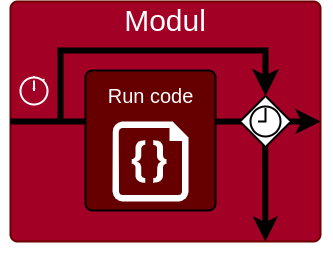

# Stream Pipeline


## Overview
`stream_pipeline` is a modular pipeline designed to handle data streams, for eaxample audio streams. This project aims to provide a robust and flexible framework for processing streaming data through a series of modular and configurable components. Each step will be measured and can be used to optimize the pipeline.

## How to use this package
1. Create a new file called requirements.txt in the root of your project and add the following line:
```
git+https://github.com/JulianKropp/stream_pipeline
mypy
```
2. Install the package by running the following command:
```bash
pip3 install -r requirements.txt
```
3. Example: Create three files called `main.py`, `server_external_module.py` and `data.py` in the root of your project and add this example from this repository to the files.
- [`main.py`](https://github.com/JulianKropp/stream_pipeline/blob/main/main.py)
- [`server_external_module.py`](https://github.com/JulianKropp/stream_pipeline/blob/main/server_external_module.py)
- [`data.py`](https://github.com/JulianKropp/stream_pipeline/blob/main/data.py)
```bash
wget https://raw.githubusercontent.com/JulianKropp/stream_pipeline/main/server_external_module.py
wget https://raw.githubusercontent.com/JulianKropp/stream_pipeline/main/main.py
wget https://raw.githubusercontent.com/JulianKropp/stream_pipeline/main/data.py
```
4. Open two terminals and run the following commands to start the pipeline:
```bash
python3 server_external_module.py
```
```bash
python3 main.py
```


## Architecture
The architecture of `stream_pipeline` is built around a series of controllers and phases, each comprising multiple modules that process the data sequentially or in parallel, depending on the configuration. Below is a high-level description of the architecture:

### Controllers
Controllers manage the flow of data through the pipeline. Each controller can operate in different modes:
- **NOT_PARALLEL**: Processes data sequentially through phases.
- **NO_ORDER**: Processes data in parallel without any specific order.
- **ORDER_BY_SEQUENCE**: Processes data in parallel but maintains a sequence order.
- **FIRST_WINS**: Processes data in parallel and prioritizes the first completed process.

### Phases
Each controller consists of multiple phases. A phase represents a stage in the data processing pipeline. Within each phase, data passes through several modules.

### Modules
Modules are the building blocks of the pipeline. They perform specific tasks on the data stream. There are several default types of modules you can use to create your own modules:
- **ExecutionModule**: Executes code to modify or process the data.
- **ConditionModule**: Evaluates conditions and routes the data based on the result.
- **CombinationModule**: Combines multiple modules into one.
- **ExternalModule**: Moves the execution of an module to an external server.

# Detailed Architecture Description
## Pipeline


## Controller


## Modules
### AbstractModule
Inherits from this class to create your own module.



### ConditionModule
Evaluates conditions and routes the data based on the result.


### CombinationModule
Combines multiple modules into one.


### ExternalModule
Moves the execution of a module to an external server. It uses gRPC to communicate with the external server.


# Future Plans

## Scaling the Pipeline
The pipeline is designed to be scalable, allowing for the distribution of data processing tasks across multiple instances or nodes. At the moment I have two ideas on how to achieve this:

### Reverse Proxy
Use the external module with a reverse proxy. So you can create a K3s cluster with a reverse proxy and the external modules. The reverse proxy will distribute the requests to the external modules.

### Lookaside Load Balancer (Just an idea in my head)
The whole pipeline is managed by a look-aside load balancer which changes the path the packages go through during runtime. The look-aside load balancer can be configured to change the path based on the load of the external modules.

```mermaid
flowchart TD
    subgraph Clients
        direction RL
        ClientA[Client A]
        ClientB[Client B]
        ClientC[Client C]
        ClientD[Client D]
        ClientE[Client E]
        ClientF[Client F]
        ClientG[Client G]
        ClientH[Client H]
        ClientI[Client I]
    end
    ClientA -->|Request| PipelineA
    ClientB -->|Request| PipelineA
    ClientC -->|Request| PipelineB
    ClientD -->|Request| PipelineC
    ClientE -->|Request| PipelineD
    ClientF -->|Request| PipelineD
    ClientG -->|Request| PipelineD
    ClientH -->|Request| PipelineE
    ClientI -->|Request| PipelineF

    subgraph LoadBalancer
        direction LR
        LLBM[Lookaside Load Balancer Module]
        LLBP[Lookaside Load Balancer Pipeline]
    end

    Clients --> | Request a Pipeline | LLBP
    LLBM --> |Manage Pipelines| Pipelines
    Pipelines --> | Sends Status | LoadBalancer
    Modules -->|Sends Status| LLBM

    subgraph Modules
        direction RL
        ExternalModuleA[External Module A]
        ExternalModuleB[External Module B]
        ExternalModuleC[External Module C]
        ExternalModuleD[External Module D]
    end

    subgraph Pipelines
        direction RL
        PipelineA -->|Request| ExternalModuleA
        PipelineB -->|Request| ExternalModuleA
        PipelineC -->|Request| ExternalModuleB
        PipelineD -->|Request| ExternalModuleC
        PipelineE -->|Request| ExternalModuleD
        PipelineF -->|Request| ExternalModuleD
    end
```

# Dev
## Install dependencies to work
```
pip3 install -r requirements.txt
pip3 install grpcio-tools mypy-protobuf mypy
```

## Check for type errors
```
pip3 install mypy
mypy --check-untyped-defs --disallow-untyped-defs main.py
mypy --check-untyped-defs --disallow-untyped-defs server_external_module.py
```

## After changing something in proto file
Generate proto files:
```
pip3 install grpcio-tools mypy-protobuf mypy
cd stream_pipeline && python -m grpc_tools.protoc -I. --python_out=. --grpc_python_out=. --mypy_out=. --mypy_grpc_out=. data.proto && cd ..
```
There will be an import error:
error:
```json
{
    "message": "No module named 'data_pb2'",
    "id": "Error-e22a2f0e-bde3-4ae4-ac34-d77388b17a9e",
    "type": "ModuleNotFoundError",
    "traceback": [
        "Traceback (most recent call last):",
        "/home/user/stream_pipeline/main.py:171",
        "/home/user/stream_pipeline/main.py:11",
        "/home/user/stream_pipeline/stream_pipeline/module_classes.py:12",
        "/home/user/stream_pipeline/stream_pipeline/data_pb2_grpc.py:6",
        "ModuleNotFoundError: No module named 'data_pb2'"
    ],
    "thread": "MainThread",
    "start_context": "N/A",
    "thread_id": 140072941379584,
    "is_daemon": false
}
```
Fix: Change `import data_pb2 as data__pb2` to `from . import data_pb2 as data__pb2` in `stream_pipeline/data_pb2_grpc.py:6`


